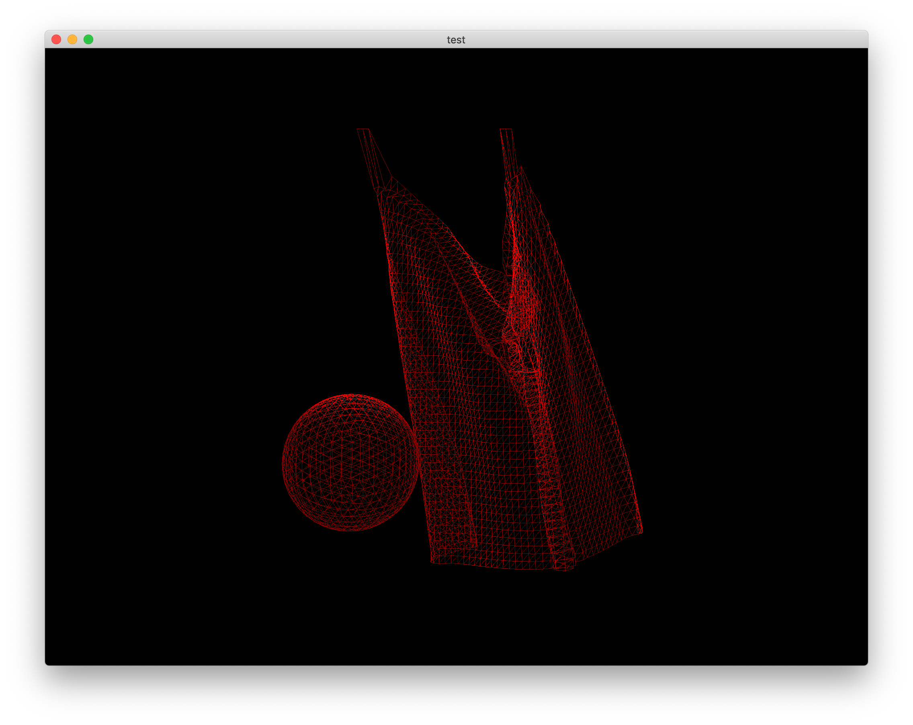

# cloth simulation with compute shader with modern opengl features

- cloth simulation (constraint, particles)
- sphere rendering (icoshadron)
- sphere collision detection
- calculate physics in compute shader (GPU accleration)

## TODO

- sphere center, radius dismatch
- at the moment, calculate physics in cpu side
- box vs cloth collision
- normal, texcoord generation